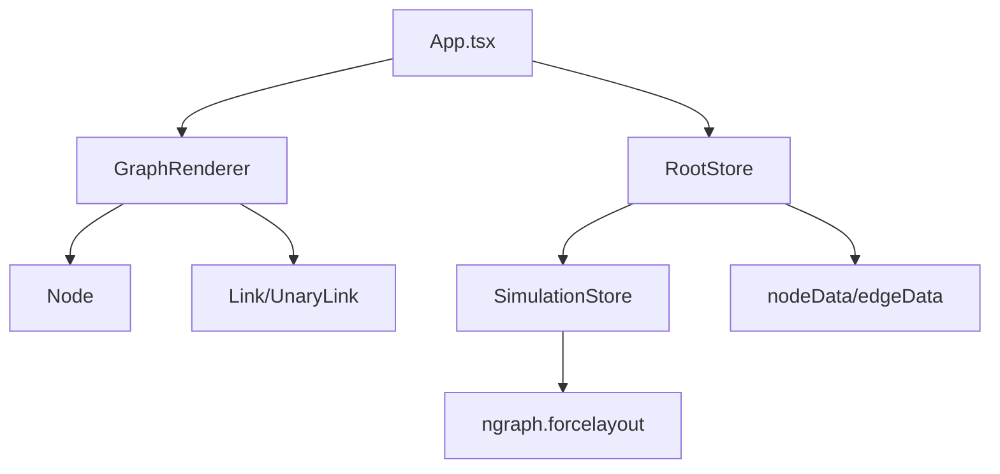
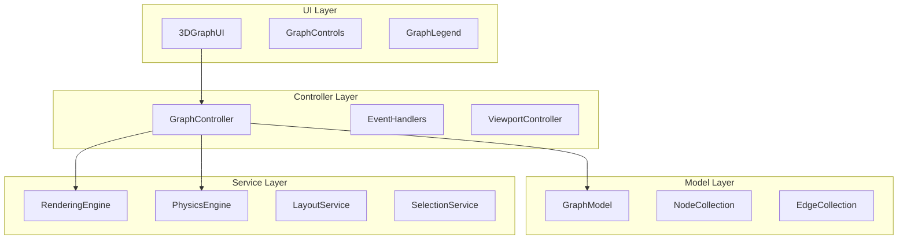
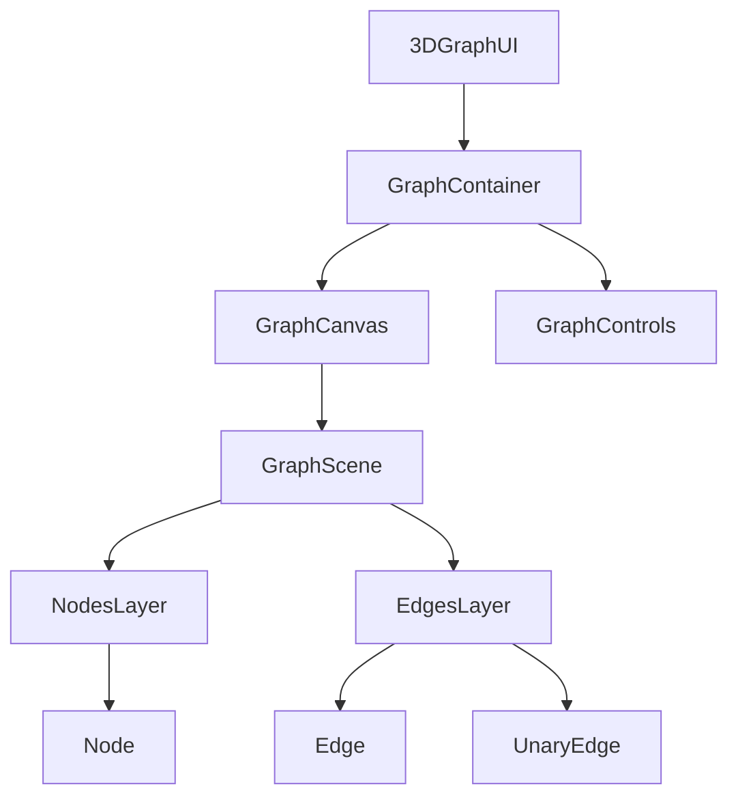
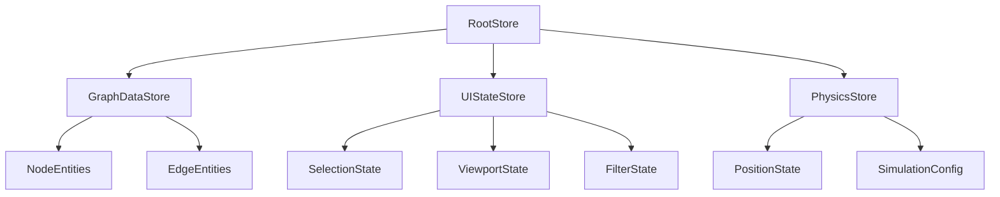
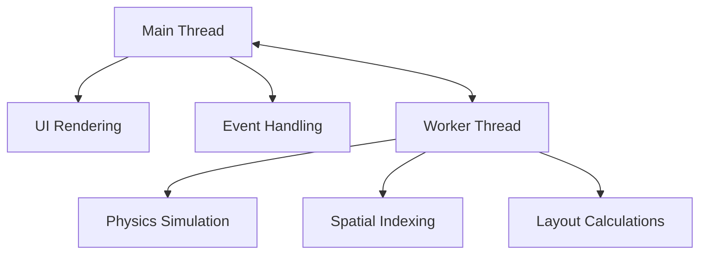
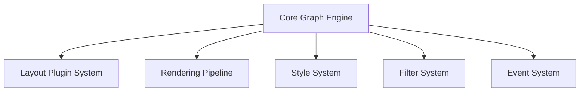

# 3D Graph UI Component: Architectural Improvement Plan

## 1. Current Architecture Assessment

Based on analysis of the codebase, here's a summary of the current architecture and its issues:



### Key Issues Identified:

1. **Poor Separation of Concerns**
   - App.tsx handles data processing, state management, and rendering
   - Direct manipulation of store data from components
   - Physics simulation and rendering logic are intertwined

2. **Inefficient State Management**
   - Overuse of global state in RootStore
   - Inefficient updates causing unnecessary re-renders
   - Manual position updates in multiple places

3. **Performance Limitations**
   - No optimizations for large graphs
   - Physics simulation runs on main thread
   - Rendering all nodes/edges regardless of visibility

4. **Code Organization Issues**
   - Inconsistent file structure
   - Many `@ts-ignore` comments and type issues
   - Hardcoded values scattered throughout

5. **Limited Extensibility**
   - Difficult to add new features like filtering or custom layouts
   - No clear extension points for customization

## 2. Proposed Architecture

A modular, layered architecture with clear separation of concerns:



## 3. Detailed Implementation Plan

### Phase 1: Restructure Component Hierarchy



#### Implementation Steps:

1. **Create Base Components**:
   - Create `GraphContainer.tsx` to manage layout and dimensions
   - Create `GraphCanvas.tsx` to handle Three.js canvas setup
   - Create `GraphScene.tsx` to manage the 3D scene

2. **Implement Layer Components**:
   - Create `NodesLayer.tsx` to manage node rendering
   - Create `EdgesLayer.tsx` to manage edge rendering
   - Refactor existing Node and Link components

3. **Refactor Entry Point**:
   - Update `App.tsx` to use the new component structure
   - Move event handling to appropriate components
   - Implement proper prop drilling

### Phase 2: Implement Modular State Management



#### Implementation Steps:

1. **Create Domain Models**:
   - Define clear interfaces for Node and Edge entities
   - Implement proper validation and type checking
   - Create immutable data structures where appropriate

2. **Implement Store Modules**:
   - Create `GraphDataStore.ts` for graph data
   - Create `UIStateStore.ts` for UI state
   - Create `PhysicsStore.ts` for simulation state

3. **Optimize State Updates**:
   - Use MobX actions for all state changes
   - Implement computed values for derived data
   - Add proper TypeScript typing throughout

4. **Implement Store Integration**:
   - Create proper context providers
   - Use React hooks for store access
   - Implement selector pattern to minimize re-renders

### Phase 3: Optimize Performance for Large Graphs

#### 3.1 Move Physics Simulation to Web Worker



**Implementation Steps**:
1. Create a worker file for physics simulation
2. Implement message passing protocol
3. Move ngraph.forcelayout to worker
4. Add batched updates for position data

#### 3.2 Implement Rendering Optimizations

**Implementation Steps**:
1. Add frustum culling for off-screen elements
2. Implement level-of-detail rendering
3. Use instanced mesh rendering for nodes
4. Optimize material usage and reuse

#### 3.3 Add Spatial Indexing

**Implementation Steps**:
1. Implement spatial hash grid or octree
2. Use for faster node/edge lookup
3. Optimize collision detection
4. Support spatial queries for selection

### Phase 4: Improve Code Organization

```
src/
├── components/          # UI components
│   ├── Graph/           # Main graph components
│   ├── Node/            # Node-related components
│   ├── Edge/            # Edge-related components
│   └── Controls/        # UI controls
├── hooks/               # Custom React hooks
├── stores/              # MobX stores
├── services/            # External services
│   ├── physics/         # Physics simulation
│   ├── rendering/       # Three.js utilities
│   └── layout/          # Layout algorithms
├── utils/               # Helper functions
├── types/               # TypeScript type definitions
└── config/              # Configuration constants
```

**Implementation Steps**:
1. Reorganize files according to new structure
2. Extract constants to configuration files
3. Create utility functions for common operations
4. Add proper documentation and comments

### Phase 5: Add Extension Points for Future Features



**Implementation Steps**:
1. Create plugin system for layout algorithms
2. Implement style system for node/edge appearance
3. Add filtering and query capabilities
4. Create event middleware for custom interactions

## 4. Technical Implementation Details

### 4.1 Component Structure

**GraphContainer.tsx**:
```typescript
interface GraphContainerProps {
  width?: number | string;
  height?: number | string;
  children?: React.ReactNode;
}

const GraphContainer: React.FC<GraphContainerProps> = ({
  width = '100%',
  height = '100%',
  children,
}) => {
  const containerRef = useRef<HTMLDivElement>(null);
  const [dimensions, setDimensions] = useState({ width: 0, height: 0 });
  
  // Dimension handling logic
  
  return (
    <div ref={containerRef} style={{ width, height }}>
      <div style={{ width: dimensions.width, height: dimensions.height }}>
        {children}
      </div>
    </div>
  );
};
```

**GraphCanvas.tsx**:
```typescript
interface GraphCanvasProps {
  cameraConfig?: CameraConfig;
  children?: React.ReactNode;
}

const GraphCanvas: React.FC<GraphCanvasProps> = ({
  cameraConfig = defaultCameraConfig,
  children,
}) => {
  return (
    <Canvas
      camera={cameraConfig}
      onCreated={({ gl }) => {
        // Canvas setup
      }}
    >
      {children}
    </Canvas>
  );
};
```

### 4.2 Store Structure

**GraphDataStore.ts**:
```typescript
class GraphDataStore {
  nodes = observable.map<number, NodeEntity>();
  edges = observable.map<number, EdgeEntity>();
  
  constructor() {
    makeAutoObservable(this);
  }
  
  addNode = (node: NodeData) => {
    // Implementation
  }
  
  removeNode = (id: number) => {
    // Implementation
  }
  
  // Other methods
}
```

**UIStateStore.ts**:
```typescript
class UIStateStore {
  selectedNodeId: number | null = null;
  hoveredNodeId: number | null = null;
  selectedEdgeId: number | null = null;
  hoveredEdgeId: number | null = null;
  
  constructor() {
    makeAutoObservable(this);
  }
  
  // Methods
}
```

### 4.3 Physics Worker Implementation

**physicsWorker.ts**:
```typescript
import createGraph from 'ngraph.graph';
import createLayout from 'ngraph.forcelayout';

let graph = createGraph();
let layout = createLayout(graph, {
  // Physics settings
});

self.onmessage = (event) => {
  const { type, payload } = event.data;
  
  switch (type) {
    case 'INIT':
      // Initialize simulation
      break;
    case 'ADD_NODE':
      // Add node to simulation
      break;
    case 'ADD_EDGE':
      // Add edge to simulation
      break;
    case 'STEP':
      // Step simulation and return positions
      layout.step();
      const positions = extractPositions();
      self.postMessage({ type: 'POSITIONS', payload: positions });
      break;
    // Other cases
  }
};
```

**PhysicsService.ts**:
```typescript
class PhysicsService {
  private worker: Worker;
  
  constructor() {
    this.worker = new Worker(new URL('./physicsWorker.ts', import.meta.url));
    this.setupMessageHandling();
  }
  
  private setupMessageHandling() {
    this.worker.onmessage = (event) => {
      const { type, payload } = event.data;
      
      switch (type) {
        case 'POSITIONS':
          // Update positions in store
          break;
        // Other cases
      }
    };
  }
  
  // Methods to interact with worker
}
```

### 4.4 Rendering Optimizations

**NodesLayer.tsx**:
```typescript
const NodesLayer: React.FC = observer(() => {
  const { nodes, visibleNodeIds } = useStores();
  
  // Use instanced mesh for better performance
  return (
    <>
      <InstancedMesh
        count={visibleNodeIds.length}
        // Other props
      >
        {/* Implementation */}
      </InstancedMesh>
    </>
  );
});
```

**useFrustumCulling.ts**:
```typescript
function useFrustumCulling(nodes: Map<number, NodeEntity>, camera: THREE.Camera) {
  const [visibleNodeIds, setVisibleNodeIds] = useState<number[]>([]);
  
  useFrame(() => {
    const frustum = new THREE.Frustum();
    // Calculate frustum
    
    const visible = Array.from(nodes.values())
      .filter(node => {
        // Check if node is in frustum
      })
      .map(node => node.id);
    
    setVisibleNodeIds(visible);
  });
  
  return visibleNodeIds;
}
```

### 4.5 Extension Points

**LayoutPlugin.ts**:
```typescript
interface LayoutPlugin {
  name: string;
  initialize: (nodes: NodeEntity[], edges: EdgeEntity[]) => void;
  step: () => void;
  getNodePosition: (nodeId: number) => Position;
}

class LayoutRegistry {
  private plugins: Map<string, LayoutPlugin> = new Map();
  
  registerPlugin(plugin: LayoutPlugin) {
    this.plugins.set(plugin.name, plugin);
  }
  
  getPlugin(name: string): LayoutPlugin | undefined {
    return this.plugins.get(name);
  }
}
```

**FilterSystem.ts**:
```typescript
interface FilterCriteria {
  nodeTypes?: number[];
  edgeTypes?: number[];
  // Other criteria
}

class FilterSystem {
  private filters: Map<string, FilterCriteria> = new Map();
  
  addFilter(name: string, criteria: FilterCriteria) {
    this.filters.set(name, criteria);
  }
  
  removeFilter(name: string) {
    this.filters.delete(name);
  }
  
  getVisibleNodes(nodes: Map<number, NodeEntity>): number[] {
    // Apply filters and return visible node IDs
  }
  
  getVisibleEdges(edges: Map<number, EdgeEntity>): number[] {
    // Apply filters and return visible edge IDs
  }
}
```

## 5. Migration Strategy

To ensure a smooth transition to the new architecture:

1. **Create Adapter Layer**:
   - Implement facade pattern for new internals
   - Maintain backward compatibility with current API

2. **Incremental Refactoring**:
   - Start with state management refactoring
   - Then implement component structure changes
   - Finally add performance optimizations

3. **Testing Strategy**:
   - Add unit tests for core functionality
   - Implement visual regression testing
   - Create performance benchmarks

4. **Documentation**:
   - Document new architecture and components
   - Create usage examples for new features
   - Provide migration guide for breaking changes

## 6. Expected Benefits

The proposed architecture will deliver significant improvements:

1. **Better Performance**:
   - Support for much larger graphs
   - Smoother interactions and animations
   - Reduced memory usage

2. **Improved Maintainability**:
   - Clear separation of concerns
   - Better TypeScript typing
   - Consistent code organization

3. **Enhanced Extensibility**:
   - Easy to add new features
   - Support for plugins and customization
   - Clear extension points

4. **Better Developer Experience**:
   - Clearer component API
   - Better documentation
   - Easier debugging