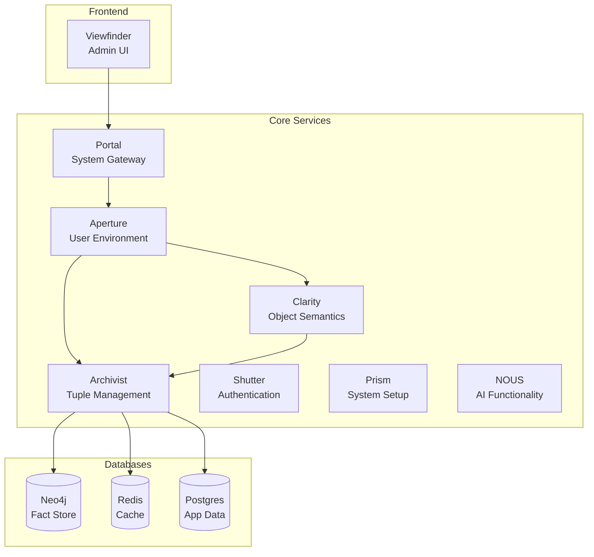
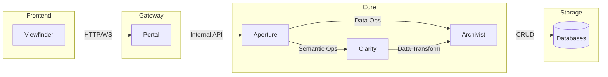

# System Architecture Overview

## Table of Contents
- [Introduction](#introduction)
- [System Components](#system-components)
- [Data Flow](#data-flow)
- [Database Architecture](#database-architecture)
- [Integration Patterns](#integration-patterns)
- [Component Interactions](#component-interactions)

## Introduction

The system implements a distributed architecture focused on semantic data processing and AI-enhanced operations. It uses a microservices approach with specialized components handling distinct aspects of the system's functionality.

### High-Level Architecture



## System Components

### Core Components

1. **Clarity**
   - Primary responsibility: Object semantics and mapping
   - Handles semantic interpretation of data
   - Manages object relationships and transformations
   - Provides semantic query capabilities

2. **Archivist**
   - Primary responsibility: Raw tuple access and cache management
   - Manages data persistence and retrieval
   - Handles caching strategies
   - Coordinates database interactions

3. **Aperture**
   - Primary responsibility: User environment & session management
   - Manages user sessions and environments
   - Handles user context and preferences
   - Coordinates user-specific operations

4. **Portal**
   - Primary responsibility: System interface gateway
   - Acts as the primary API gateway
   - Manages request routing
   - Handles API versioning and protocol translation

5. **Shutter**
   - Primary responsibility: Authentication mechanisms
   - Manages user authentication
   - Handles access control
   - Implements security policies

6. **Prism**
   - Primary responsibility: System setup & batch insert
   - Handles system initialization
   - Manages batch data operations
   - Coordinates setup workflows

7. **NOUS**
   - Primary responsibility: AI functionality
   - Implements AI/ML capabilities
   - Manages AI model interactions
   - Provides intelligent processing features

8. **Viewfinder**
   - Primary responsibility: Admin UI
   - Provides administrative interface
   - Manages user interactions
   - Visualizes system data and status

## Data Flow

### Primary Data Flows

1. **User Interface Flow**
   ```mermaid
   sequenceDiagram
       participant VF as Viewfinder
       participant PT as Portal
       participant AP as Aperture
       participant CL as Clarity
       participant AR as Archivist
       participant DB as Databases
       
       VF->>PT: User Request
       PT->>AP: Process Request
       AP->>CL: Semantic Processing
       CL->>AR: Data Operation
       AR->>DB: Database Interaction
       DB->>AR: Data Response
       AR->>CL: Processed Data
       CL->>AP: Semantic Response
       AP->>PT: Formatted Response
       PT->>VF: User Response
   ```

2. **Data Processing Flow**
   - User requests flow through Portal → Aperture
   - Semantic processing occurs in Clarity
   - Data operations handled by Archivist
   - Results flow back through the chain with appropriate transformations

## Database Architecture

### Database Roles

1. **Neo4j (Fact Tuple Store)**
   - Primary use: Stores semantic fact tuples
   - Handles relationship-rich data
   - Optimized for graph queries
   - Used by Archivist for fact storage and retrieval

2. **Redis (Semantic Cache)**
   - Primary use: High-speed semantic cache
   - Stores frequently accessed data
   - Reduces database load
   - Improves response times for common queries

3. **PostgreSQL (Application Support)**
   - Primary use: Structured application data
   - Stores user and system metadata
   - Handles transactional data
   - Manages configuration data

### Database Access Patterns

1. **Neo4j Access Pattern**
   - Direct access through Archivist
   - Graph-based queries for relationship data
   - Optimized for connected data traversal

2. **Redis Cache Pattern**
   - High-speed cache for frequent queries
   - Managed by Archivist
   - Implements cache invalidation strategies

3. **PostgreSQL Access Pattern**
   - Traditional RDBMS access
   - Handles structured data requirements
   - Supports ACID transactions

## Integration Patterns

### Core Integration Patterns

1. **Service-to-Service Communication**
   - REST APIs for synchronous operations
   - WebSocket for real-time updates
   - Event-driven for asynchronous operations

2. **Data Integration**
   - Clarity handles semantic transformation
   - Archivist manages data persistence
   - Cache coordination through Redis

3. **Security Integration**
   - Shutter provides authentication
   - Token-based service authentication
   - Role-based access control

### Key Integration Points

1. **Clarity-Archivist Integration**
   - Semantic data transformation
   - Object-tuple mapping
   - Cache coordination

2. **Aperture-Clarity Integration**
   - User context management
   - Environment-specific processing
   - Session-based operations

3. **Portal-Aperture Integration**
   - Request routing
   - Protocol translation
   - Session management

4. **Viewfinder-Portal Integration**
   - UI data flow
   - Admin operations
   - System monitoring

## Component Interactions

### Primary Interaction Patterns



### Critical Paths

1. **Data Access Path**
   - Viewfinder → Portal → Aperture → Archivist → Databases
   - Optimized for data retrieval and updates

2. **Semantic Processing Path**
   - Aperture → Clarity → Archivist
   - Handles semantic interpretation and transformation

3. **Authentication Path**
   - Portal → Shutter → Aperture
   - Manages user authentication and session creation