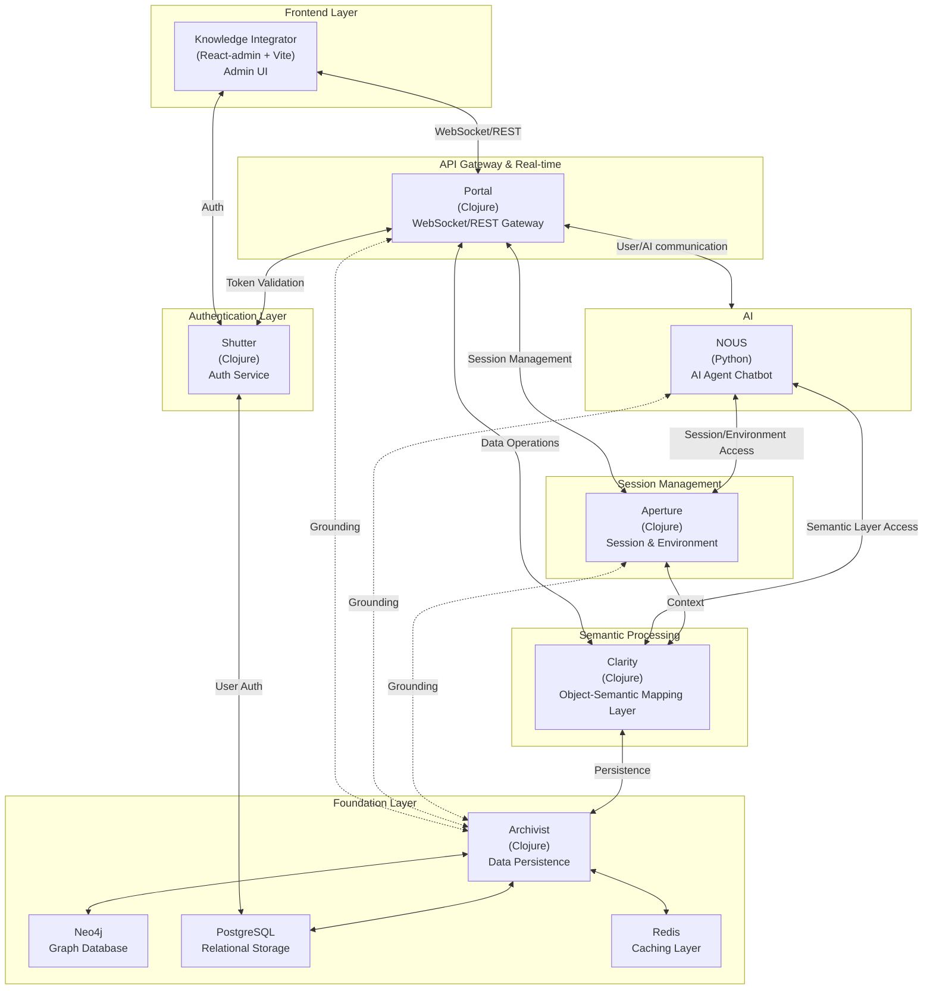

# Systema Relica

[Semantic Data Modelling](https://en.wikipedia.org/wiki/Gellish) for Next Generation Cognitive Applications

## Overview

Systema Relica is a comprehensive platform for semantic data modeling and management designed for modern cognitive applications.

## Quick Start

Clone the repository:

```bash
git clone https://github.com/corpus-relica/systema-relica.git
```

Start the application using Docker:

```bash
docker-compose up --build -d
```

## Architecture

Systema Relica follows a microservice architecture with components written in multiple languages communicating over REST with heavy emphasis on WebSockets:

- Clojure services for data processing and backend functionality
- TypeScript for frontend and some [legacy] backend services
- Python for specialized components (e.g. Nous AI agent)

### Components

- **Archivist**: Raw data management service
- **Clarity**: Semantic translation layer
- **Aperture**: User environment management
- **Shutter**: Authentication
- **Portal**: System interface layer
- **Viewfinder**: User interface
- **Nous**: AI agent

## Development

### Prerequisites

- Docker and Docker Compose
- Node.js and Yarn
- Clojure development environment
- Python 3.x

### Project Structure

```
systema-relica/
├── packages_clj/         # Clojure packages
│   ├── aperture/         # User environment management
│   ├── archivist/        # Raw data management
│   ├── clarity/          # Semantic translation
│   ├── common/           # Shared code
│   ├── portal/           # System interface
│   ├── prism/            # First-time startup data seed; xls data import/export
│   └── shutter/          # Authentication
├── packages_py/          # Python packages
│   └── nous/             # AI agent
├── packages_ts/          # TypeScript packages
│   ├── backend/          # Backend services [Legacy]
│   │   ├── archivist/    # Data management service [Legacy]
│   │   │   ├── seed_csv/ # CSV seed data [Legacy]
│   │   │   ├── seed_xls/ # Excel seed data [Legacy]
│   │   │   ├── src/      # Source code with controllers for aspects, concepts, facts, etc. [Legacy]
│   │   │   └── test/     # Test files [Legacy]
│   │   └── clarity-core/ # Core clarity engine [Legacy]
│   │       ├── src/      # Source code [Legacy]
│   │       └── test/     # Test files [Legacy]
│   ├── config/           # Configuration
│   ├── core/             # Core libraries
│   │   ├── dataplex/     # Data management platform
│   │   │   ├── init_scripts/ # Initialization scripts
│   │   │   └── nginx.conf    # Nginx configuration
│   │   └── hsm-manager/  # Hierarchical state machine manager
│   │       └── src/      # Source code
│   ├── frontend/         # Frontend applications
│   │   ├── components/   # Shared UI components
│   │   │   ├── 3d-graph-ui/               # 3D graph visualization
│   │   │   ├── fact-search-ui/            # Fact search interface
│   │   │   └── quintessential-model-viz/  # Model visualization components
│   │   └── viewfinder/   # Main frontend application
│   │       ├── public/   # Public assets
│   │       └── src/      # Source code (React components, socket, styling)
│   └── libs/             # Shared libraries
│       ├── constants/    # Shared constants
│       │   └── src/      # Source code
│       └── types/        # TypeScript type definitions
│           └── src/      # Source code
├── seed_csv/             # Seed data in CSV format
├── seed_xls/             # Seed data in Excel format
└── docker-compose.yml    # Docker composition
```



### Communication Layer

The system currently uses EDN for communication between Clojure clients and JSON for other clients in the websocket communication layer. There are plans to evaluate Nippy as a potential replacement for improved performance.

## Deployment

[Deployment instructions to be added]

## License

See the [LICENSE](LICENSE) file for details.
